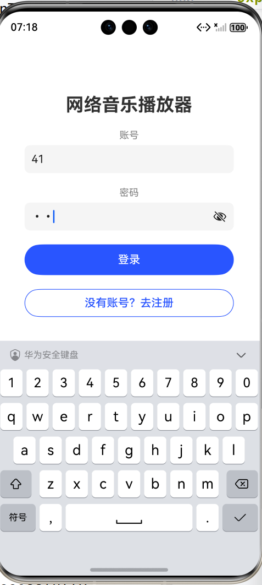
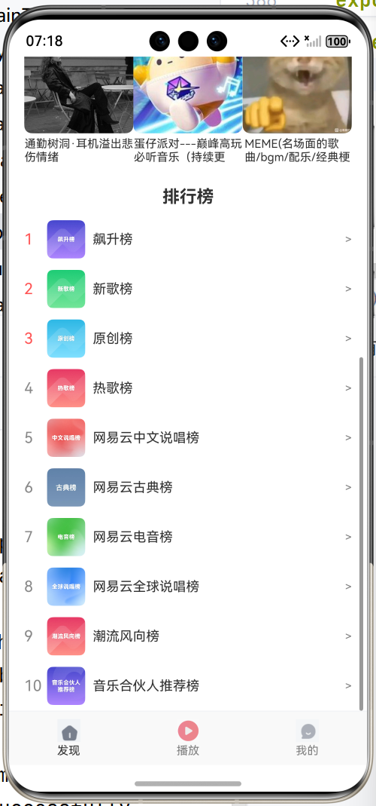
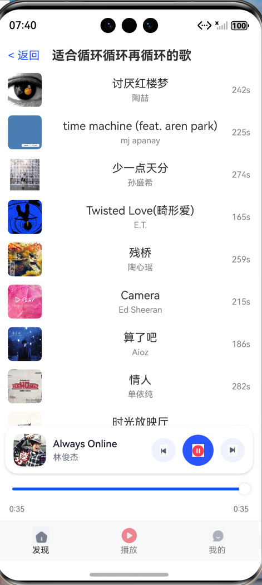
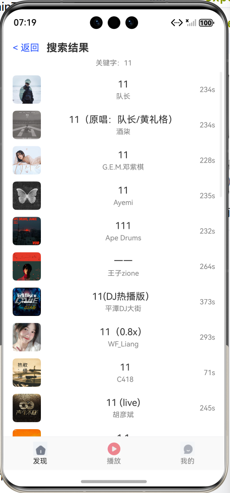
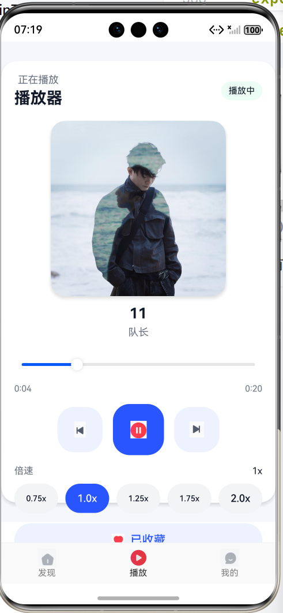
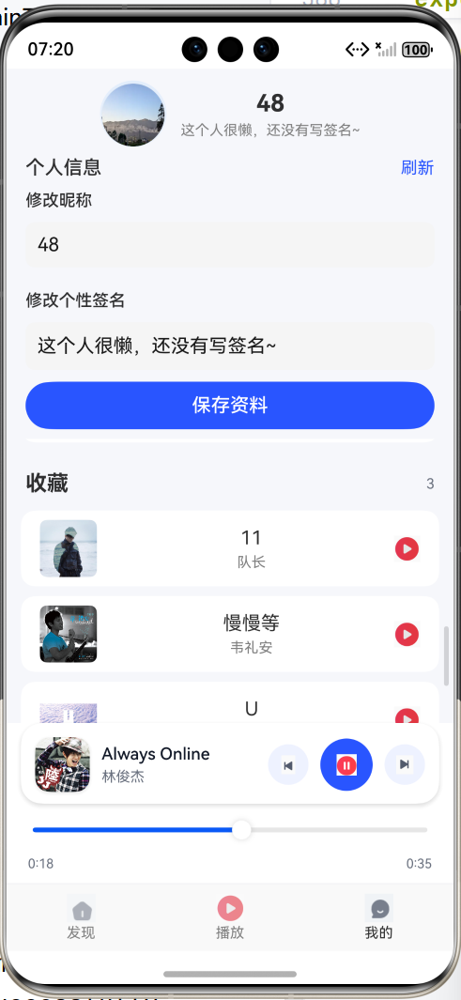

# HarmonyOS 音乐播放器（ArkUI ETS）课程作业

> 一个基于 **HarmonyOS** 的音乐播放应用 Demo。  
> 支持歌单浏览、搜索、播放控制、倍速、最近播放与收藏（Preferences 持久化），并提供底部 Mini 播放条（PlayerBar）。

---

## 1. 应用功能说明（图文展示）

### 1.1 功能清单
- **登录页**
  - 实现用户的登录和注册
- **发现页（推荐/榜单/歌单）**
  - 展示推荐歌单与榜单歌单
  - 进入歌单查看歌曲列表并播放
- **搜索**
  - 按关键字搜索歌曲
  - 点击歌曲播放（自动写入最近播放）
- **播放器**
  - 播放 / 暂停
  - 上一首 / 下一首（队列切歌）
  - **进度条拖拽 Seek（支持 PlayerPage 与 PlayerBar）**
  - 倍速播放（0.75x / 1.0x / 1.25x / 1.75x / 2.0x）
  - 收藏 / 取消收藏
- **我的**
  - 修改昵称、个性签名
  - 展示 **最近播放**（最多 10 条，去重置顶）
  - 展示 **收藏列表**（上限可控，例如 200 条）
- **底部 Mini 播放条（PlayerBar）**
  - 显示封面、歌曲名、歌手
  - 播放/暂停、上一首/下一首
  - 迷你进度条拖拽

---


#### README 引用










---

## 2. 编译运行步骤

### 2.1 开发环境版本
- **DevEco Studio：6.0（推荐）**
- **HarmonyOS SDK：与 DevEco Studio 自带 SDK 保持一致（API 版本以项目可编译为准）**
- 语言/框架：ArkUI (ETS)
- 运行：HarmonyOS 模拟器或真机

---

### 2.2 依赖环境（后端服务：必须）
本项目通过局域网访问 NeteaseCloudMusicApi（或等价服务），即后端提供：
- `/search`
- `/playlist/detail`
- `/personalized`
- `/song/url`
- `/toplist/detail`
- （可选兜底）`/song/detail?ids=...` 用于补齐封面

#### 后端启动要求
- 在电脑/服务器启动后端服务（默认端口常用 3000）
- 保证 **手机/模拟器与后端在同一局域网**
- 保证设备可以访问后端 URL（可用浏览器测试）

> 说明：若作业包含“自行架设开发者服务器”，建议同时提供 **服务端部署文件**（如 `package.json / app.js`、环境配置说明）、以及如涉及数据库则提供 **数据库建表脚本/初始化脚本**（如 `schema.sql / init.sql`），便于他人一键复现。

---

### 2.3 服务端如何运行（示例：Node.js）
> 以下为常见 Node 服务运行方式，按你的服务端项目实际情况调整命令。

1. 在终端进入服务端目录：
```bash
cd server
```

2. 安装依赖：
```bash
npm install
```

3. 启动服务（任选一种）：
```bash
node app.js
# 或
npm run start
```

4. 启动成功后，在浏览器验证（示例）：
- `http://<你的电脑IP>:3000/search?keywords=周杰伦`

---

### 2.4 配置后端地址（必须）
后端地址在此文件配置：

- `entry/src/main/ets/service/ApiService.ets`

找到类似代码并修改为你自己电脑的局域网 IP：
```ts
const BASE_URL: string = 'http://192.168.xx.xx:3000';
```

> 注意：换电脑/换网络/重连 WiFi 后，局域网 IP 可能变化；如果 `BASE_URL` 未同步修改，应用将无法搜索/拉歌单/播放。

---

### 2.5 编译运行步骤
1. **启动后端服务**（确保已监听 3000 端口）
2. 确认手机/模拟器与后端在同一网络，并能访问 `BASE_URL`
3. DevEco Studio 打开工程
4. 连接真机或启动模拟器
5. 点击 **Run** 运行项目

---

## 3. 数据存储与同步说明（注意事项）

### 3.1 Preferences 本地持久化
- 最近播放：`recent_songs`
- 收藏：`favorite_songs`
- 用户资料：`user_profile`

在 `PreferencesStore.ets` 中使用 **ApplicationContext** 获取 Preferences，避免不同页面/Ability 的 Context 导致读写不一致。

---

### 3.2 常见问题与排查

#### Q1：搜索结果无封面/显示灰色
可能原因：
1) 搜索接口返回字段结构不同，导致 `coverUrl` 映射为空  
2) 图片 URL 为 `http://...`，设备策略可能导致加载失败

排查方式：
- 在搜索成功后打印首条 `coverUrl` 是否为空
- 确保 `ApiService.ets` 中封面字段映射包含 `album.picUrl / al.picUrl / picUrl / coverUrl` 等兜底
- 将 `http://` 转为 `https://`（如后端返回的是 http）

---

#### Q2：最近播放/收藏写入成功，但“我的页”不显示
原因通常不是 Preferences，而是 UI 渲染方式/布局（例如 Scroll 与 List 嵌套、固定高度导致不可见）。  
建议做法：
- 使用 `Scroll + Column + ForEach` 渲染列表更稳定
- 适当给底部留白，避免 PlayerBar 覆盖列表

---

#### Q3：无法请求后端（播放/搜索失败）
- 检查 `BASE_URL` 是否可访问
- 检查手机/模拟器与后端是否在同一网段
- 检查后端服务是否启动、端口是否正确、电脑防火墙是否放行

---

## 4. 项目结构
- `entry/src/main/ets/service/ApiService.ets`：后端请求与数据映射
- `entry/src/main/ets/service/AudioPlayerService.ets`：AVPlayer 播放控制（play / pause / seek / speed / prev / next）
- `entry/src/main/ets/service/PreferencesStore.ets`：Preferences 持久化（最近播放/收藏/用户资料）
- `entry/src/main/ets/pages/`：页面（发现、搜索、播放器、我的）
- `entry/src/main/ets/components/PlayerBar.ets`：底部 mini 播放条
- `entry/src/main/ets/common/UI.ets`：统一按钮组件（图片按钮等）

---

## 5. 备注(叠个甲)
- 本项目为课程作业用途，接口数据来源于本地部署的音乐 API 服务，仅用于学习与演示。
